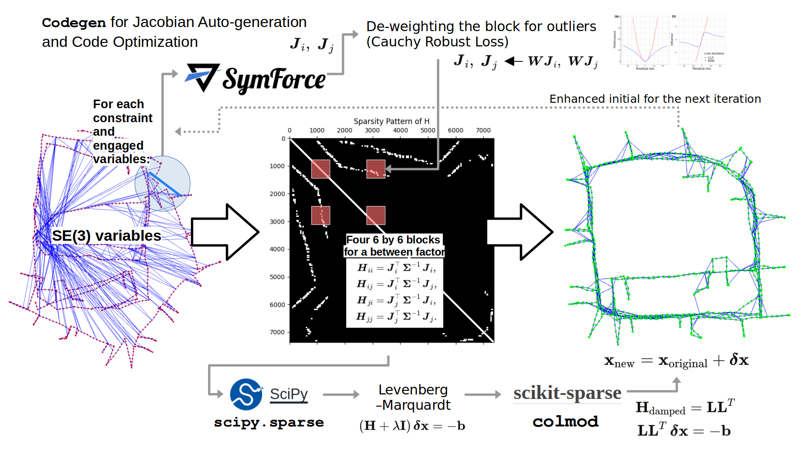

# nano-pgo
 
*Figure 1: Example Results Visualization. More examples can be found [here](docs/results/visualization).*

- Features 
    - For an education purpose
    - From-scratch pose-graph optimization implementation
        - This tried to maximize the code-level transparency of the process of generating the H and b matrices, building a linear system, and controlling the LM iterations.
    - A single file
    - Miminum dependencies: numpy/scipy/symforce/sksparse (and open3d for visualization).
        - numpy for basic matrix handling 
        - scipy for basic rotation functions and sparse matrix containers 
        - symforce for the auto-generated symbolic Jacobian (optional)
        - sksparse for cholmod and solve function
        - open3d for large-sized point cloud (pose-graph) visualization
    - I hope this hands-on tutorial code can also be used as training material for Symforce's auto-generated optimized Jacobian code generation (codegen).
        - For the details, see below [Symforce-based Auto-generated Jacobians](#symforce-based-auto-generated-jacobians).
- ps. This tutorial supports only batch pose-graph optimization (but with a sparse solver!) and does not cover incrementally expanding pose-graph optimization (e.g., iSAM).

## Overview 
 
*Figure 2: The pipeline of nano-pgo*

## Preparation (dependencies)
- Recommend to use python<3.12 and numpy<2, for example,
    - `$ python3.11 -m venv ~/envs/py311`
    - `$ source ~/envs/py311/bin/activate`
    - `$ pip install "numpy<2.0"`
    - `$ pip install scipy` 
    - `$ sudo apt-get install libsuitesparse-dev` 
    - `$ pip install scikit-sparse`
    - `$ pip install symforce`
    - `$ pip install matplotlib`
    - `$ pip install open3d`

## How to use 
- `$ python nano_pgo.py`
    - It's also recommended to compare the results from GTSAM (better and faster!) by using `baseline_gtsam.py`.
- Note that the nano_pgo.py's goal is a maximized transparency of all logics and theories from state representations to building and solving linear systems.
- [Demo video can be found here](https://youtu.be/tEdIfHYY3uQ?si=sKo4jC2UZS_uiSSR).
 
## Goal 
- Understand 
    - what is pose-graph optimization.
    - what is a g2o-format pose-graph data.
    - what is se(3) and SE(3) (the tangent space and the manifold).
    - what is iterative least-square optimization and solving normal equation.
    - what is the error and jacobians of between factors and how to be derived.
    - what is the gauge freedom of pose-graph SLAM.
    - why sparse solver is necessary (here, we used sksparse.cholmod).
    - why damping is necessary (i.e., LM iterative optimization method).
    - why robust loss is necessary (here, we used Cauchy deweighting).
    - what are the differences between numerical and symbolic diffs.
    - how to use symforce APIs. 
    - how to use GTSAM APIs.
    - what is the real-world problems, use-cases, and state-of-the arts.
    
## Symforce-based Auto-generated Jacobians 
- SymForce eliminates the need for tedious and error-prone manual Jacobian derivations.
- You can enjoy this feature by setting `self.use_symforce_generated_jacobian=True` and `debug_compare_jacobians=True`.

*Figure 3: Auto-generated Symbolic Jacobian's effectiveness.*

- You can first automatically generate the (symbolic) Jacobian of the relative SE(3) error like this,

    ```python
    import symforce.symbolic as sf
    from symforce.ops import LieGroupOps

    # Define rotation variables (rotation vectors for each axis)
    sf_ri = sf.V3.symbolic("ri")  # Rotation of pose_i
    sf_rj = sf.V3.symbolic("rj")  # Rotation of pose_j
    sf_rij = sf.V3.symbolic("rij")  # Measured relative rotation

    # Define translation variables
    sf_ti = sf.V3.symbolic("ti")  # Translation of pose_i
    sf_tj = sf.V3.symbolic("tj")  # Translation of pose_j
    sf_tij = sf.V3.symbolic("tij")  # Measured relative translation

    # Create rotation matrices using Lie Group operations
    sf_Ri = LieGroupOps.from_tangent(sf.Rot3, sf_ri)
    sf_Rj = LieGroupOps.from_tangent(sf.Rot3, sf_rj)
    sf_Rij = LieGroupOps.from_tangent(sf.Rot3, sf_rij)

    # Construct SE(3) containers 
    sf_Ti = sf.Pose3(R=sf_Ri, t=sf_ti)
    sf_Tj = sf.Pose3(R=sf_Rj, t=sf_tj)
    sf_Tij = sf.Pose3(R=sf_Rij, t=sf_tij)

    # SE3 error: T_err = T_ij^{-1} * T_i^{-1} * T_j
    sf_T_err = sf_Tij.inverse() * (sf_Ti.inverse() * sf_Tj)

    # Convert SE3 error to a tangent vector [r, t], 6-dim.
    #  NOTE: symforce uses the [r, t] order, not [t, r].
    sf_se3_err = sf.Matrix(sf_T_err.to_tangent())

    # Define residual as the rotation and translation error
    sf_residual = sf_se3_err  # 6D vector

    # Compute the full Jacobian
    sf_J_ti = sf_residual.jacobian([sf_ti])  # 6 x 3
    sf_J_ri = sf_residual.jacobian([sf_ri])  # 6 x 3
    sf_J_tj = sf_residual.jacobian([sf_tj])  # 6 x 3
    sf_J_rj = sf_residual.jacobian([sf_rj])  # 6 x 3
    ```
- Then, next step is to inject (evaluate) the actual values to the symbolic (block of) Jacobian functions, like

    ```python
    def between_factor_jacobian_by_symforce(pose_i, pose_j, pose_ij_meas):
        """
        Computes the Jacobians for the between factor residual using Symforce symbolic computation.
    
        Parameters:
            pose_i (dict): Dictionary containing rotation vector 'r' and translation 't' for pose i.
            pose_j (dict): Dictionary containing rotation vector 'r' and translation 't' for pose j.
            pose_ij_meas (dict): Dictionary containing the measured relative rotation matrix 'R' and translation vector 't'.
    
        Returns:
            Ji (np.ndarray): 6x6 Jacobian matrix with respect to pose i.
            Jj (np.ndarray): 6x6 Jacobian matrix with respect to pose j.
    
        Note: the Ji and Jj should have shapes (6, 6) like:
                                            |  translation_variable (3-dim), rotation_variable (3-dim) |
                cost_func_translation_part  |               *                          *               |
                cost_func_rotation_part     |               *                          *               |
        """

        substitutions = {
            sf_ri: sf.V3(pose_i["r"] + epsilon),
            sf_ti: sf.V3(pose_i["t"] + epsilon),
            sf_rj: sf.V3(pose_j["r"] + epsilon),
            sf_tj: sf.V3(pose_j["t"] + epsilon),
            sf_rij: sf.V3(rotmat_to_rotvec(pose_ij_meas["R"]) + epsilon),
            sf_tij: sf.V3(pose_ij_meas["t"] + epsilon),
        }
    
        sf_J_ti_val = sf_J_ti.subs(substitutions).to_numpy()
        sf_J_ri_val = sf_J_ri.subs(substitutions).to_numpy()
        sf_J_tj_val = sf_J_tj.subs(substitutions).to_numpy()
        sf_J_rj_val = sf_J_rj.subs(substitutions).to_numpy()

        # ps. the reason why the index 3: mapped to :3
        # is because this example uses [t, r], but symforce uses the order of [r, t]
        sf_Ji = np.zeros((6, 6))
        sf_Ji[:3, :3] = sf_J_ti_val[3:, :]
        sf_Ji[3:, :3] = sf_J_ti_val[:3, :]
        sf_Ji[:3, 3:] = sf_J_ri_val[3:, :]
        sf_Ji[3:, 3:] = sf_J_ri_val[:3, :]

        sf_Jj = np.zeros((6, 6))
        sf_Jj[:3, :3] = sf_J_tj_val[3:, :]
        sf_Jj[3:, :3] = sf_J_tj_val[:3, :]
        sf_Jj[:3, 3:] = sf_J_rj_val[3:, :]
        sf_Jj[3:, 3:] = sf_J_rj_val[:3, :]

        return sf_Ji, sf_Jj
    ```
- However, the above "raw" symbolic Jacobian includes many redundant computations, making it slow. Therefore, by using SymForce's [codegen](https://symforce.org/tutorials/codegen_tutorial.html) functionality, it is possible to perform compilation and code optimization (i.e., compile the Jacobian), resulting in more than a 30x speed improvement in raw Python (here, for a single block calculation, that is a single edge's H and b, 0.0031 sec to 0.00009 sec, at a single core of AMD Ryzen 7 8845HS CPU). An example of using the Symforce `codegen` API is like:
    ```python
    # optimized code compliation process
    def sf_between_error(Ti: sf.Pose3, Tj: sf.Pose3, Tij: sf.Pose3):
        return Tij.inverse() * (Ti.inverse() * Tj)


    between_error_codegen = codegen.Codegen.function(
        func=sf_between_error,
        config=codegen.PythonConfig(),
    )

    between_error_codegen_with_jacobians = between_error_codegen.with_jacobians(
        which_args=["Ti", "Tj"],
        include_results=True,
    )

    between_error_codegen_with_jacobians_data = (
        between_error_codegen_with_jacobians.generate_function()
    )

    # copy the generated source file and import ... 
    # ...

    # Then you can use like this 
    #  (Using the above auto-geneated functions within the copied __between_error_codegen.py file)
    _, res_D_Ti, res_D_Tj = sf_between_error_with_jacobians01(
        Ti=sym.Pose3(R=sym.rot3.Rot3(rotvec_to_quat(pose_i["r"])), t=pose_i["t"]),
        Tj=sym.Pose3(R=sym.rot3.Rot3(rotvec_to_quat(pose_j["r"])), t=pose_j["t"]),
        Tij=sym.Pose3(
            R=sym.rot3.Rot3(rotvec_to_quat(pose_ij_meas["r"])),
            t=pose_ij_meas["t"],
        ),
    )

    # see `between_factor_jacobian_by_symforce` function in the `nano_pgo.py` for the details.
    ```

## TODO
- Equipped with better initialization strategies (e.g., rotation averaging) 
- Detailed teaching materials

## Acknowledgement 
- Datasets from https://lucacarlone.mit.edu/datasets/

