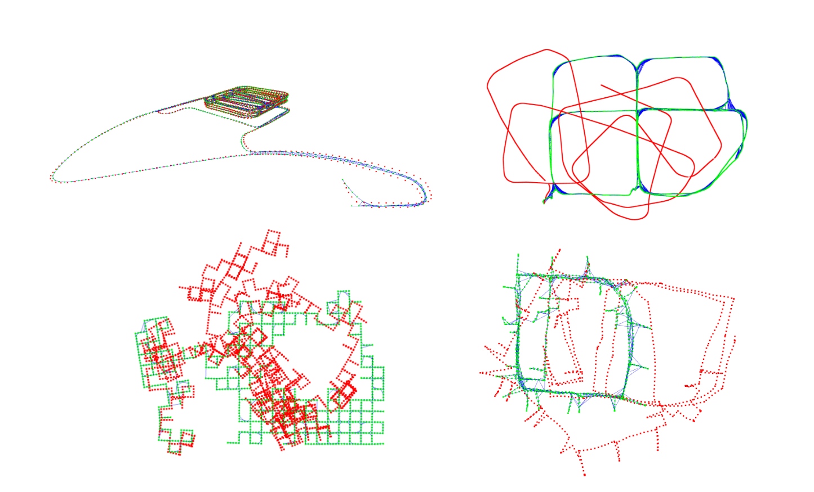
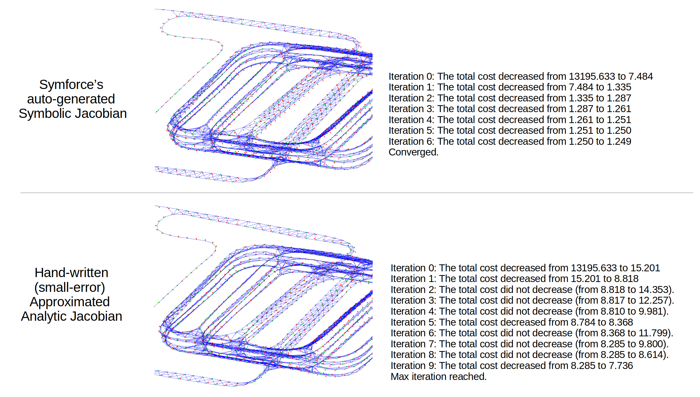

# nano-pgo
 
- For an education purpose
- From-scratch pose-graph optimization implementation
- A single file
- Miminum dependencies: numpy/scipy/sksparse (and open3d for visualization).
    - numpy for basic matrix handling 
    - scipy for basic rotation functions and sparse matrix containers 
    - sksparse for cholmod and solve function
    - open3d for large-sized point cloud (pose-graph) visualization
    - (optional) symforce for the auto-generated symbolic Jacobian

## Preparation (Dependencies)
- Recommend to use python<3.12 and numpy<2, for example,
    - `$ python3.11 -m venv ~/envs/py311`
    - `$ source ~/envs/py311/bin/activate`
    - `$ pip install "numpy<2.0"`
    - `$ pip install scipy` 
    - `$ sudo apt-get install libsuitesparse-dev` 
    - `$ pip install scikit-sparse`
    - `$ pip install matplotlib`
    - `$ pip install open3d`
    - `$ pip install symforce`

## How to use 
- `$ python nano_pgo.py`
- It's also recommended to compare the results from GTSAM (better and faster!) by using `baseline_gtsam.py`.
- Note that the nano_pgo.py's goal is a maximized transparency of all logics and theories from state representations to building and solving linear systems.

## Goal 
- Understand 
    - what is pose-graph optimization
    - what is a g2o-format pose-graph data 
    - what is se(3) and SE(3) (the tangent space and the manifold)
    - what is iterative least-square optimization and solving normal equation
    - what is the error and jacobians of between factors and how to be derived
    - why sparse solver is necessary (here, we used sksparse.cholmod)
    - why damping is necessary (i.e., LM iterative optimization method)
    - why robust loss is necessary (here, we used Cauchy deweighting)
    - what are the differences between numerical and symbolic diffs.
    - how to use symforce APIs. 
    - how to use GTSAM APIs.
    - what is the real-world problems, use-cases, and state-of-the arts
    
## Symforce-based Auto-generated Jacobians 
- SymForce eliminates the need for tedious and error-prone manual Jacobian derivations.
- You can enjoy this feature by setting `self.use_jacobian_approx_fast=False` and `debug_compare_jacobians=True`.

## TODO
- Equipped with better initialization strategies (e.g., rotation averaging) 
- Detailed teaching materials

## Acknowledgement 
- Datasets from https://lucacarlone.mit.edu/datasets/

